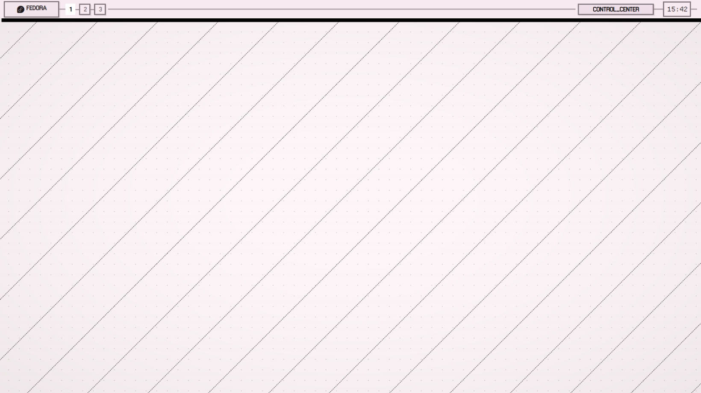
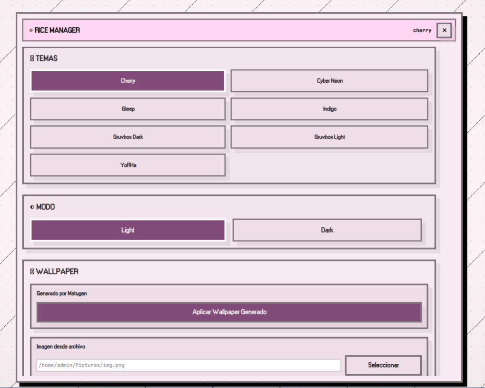
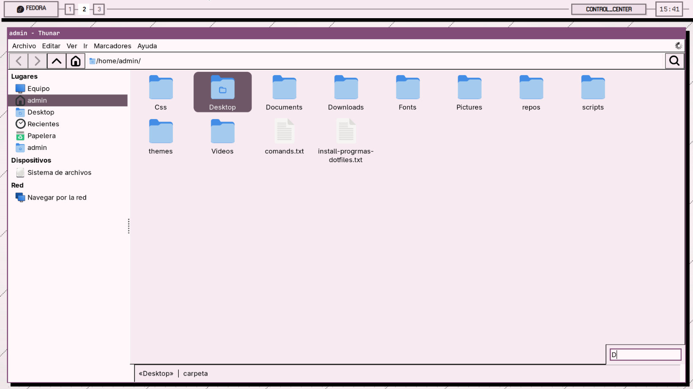
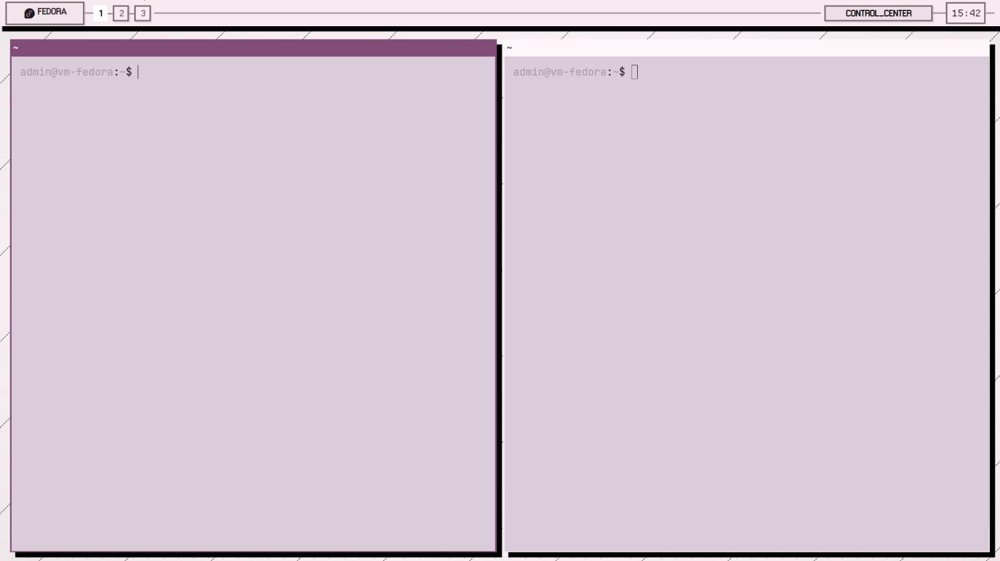

# LinuxME Dotfiles

Repositorio de dotfiles para SwayFX + Quickshell + Matugen.

## Screenshots

### Desktop



### Config Manager



### File Explorer



### Terminal



## Estructura

- dotfiles/.config: configuraciones enlazables a ~/.config
- dotfiles/scripts: scripts de rice-manager y launcher
- dotfiles/themes: temas .theme
- install: instaladores y utilidades de export/deploy

## Flujo recomendado

1) Exportar tu estado actual de dotfiles al repo:

```bash
./install/export-current-dotfiles.sh
```

2) Instalar dependencias en Fedora:

```bash
./install/install-fedora.sh
```

3) Desplegar dotfiles en HOME (con backup automatico):

```bash
./install/deploy-dotfiles.sh
```

4) O hacer todo junto:

```bash
./bootstrap.sh
```
